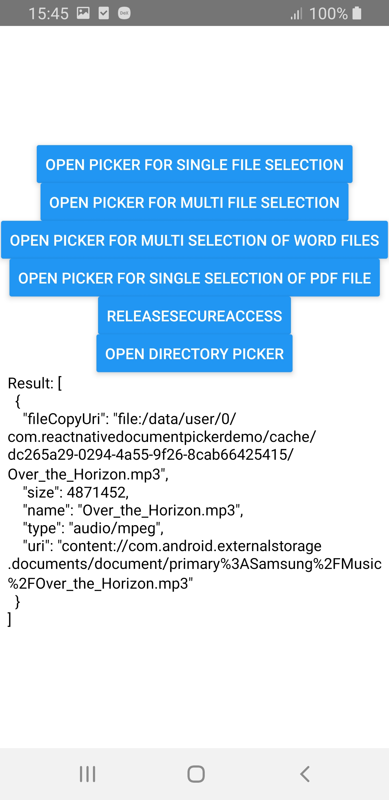
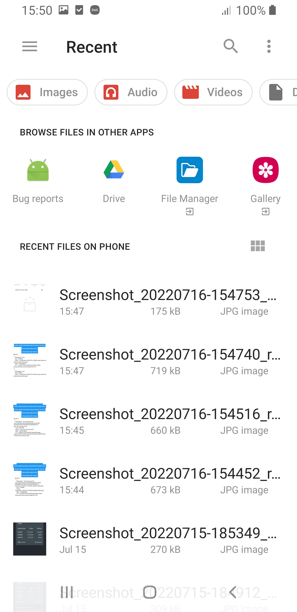
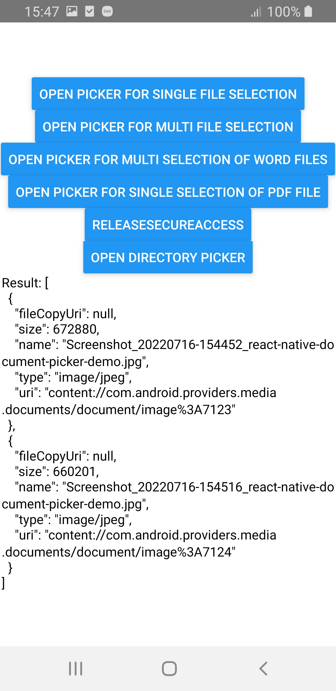

# React Native Document Picker Demo

[react-native-document-picker](https://github.com/rnmods/react-native-document-picker) is a React Native wrapper for:

- *Apple*'s UIDocumentPickerViewController
- *Android*'s Intent.ACTION_GET_CONTENT
- *Windows* Windows.Storage.Pickers

## Demo

| Screenshots |  |  | 
|:---:|:---:|:---:|
|  |  |  |


## Install

```
npm i --save react-native-document-picker
```

or

```
yarn add react-native-document-picker
```

## Example

```
import React from 'react'

import { StyleSheet, View, Text, Button } from 'react-native'
import DocumentPicker, {
  DirectoryPickerResponse,
  DocumentPickerResponse,
  isInProgress,
  types,
} from 'react-native-document-picker'
import { useEffect } from 'react'

export default function App() {
  const [result, setResult] = React.useState()

  useEffect(() => {
    console.log(JSON.stringify(result, null, 2))
  }, [result])

  const handleError = (err) => {
    if (DocumentPicker.isCancel(err)) {
      console.warn('cancelled')
      // User cancelled the picker, exit any dialogs or menus and move on
    } else if (isInProgress(err)) {
      console.warn('multiple pickers were opened, only the last will be considered')
    } else {
      throw err
    }
  }

  return (
    <View style={styles.container}>
      <Button
        title="open picker for single file selection"
        onPress={async () => {
          try {
            const pickerResult = await DocumentPicker.pickSingle({
              presentationStyle: 'fullScreen',
              copyTo: 'cachesDirectory',
            })
            setResult([pickerResult])
          } catch (e) {
            handleError(e)
          }
        }}
      />
      <Button
        title="open picker for multi file selection"
        onPress={() => {
          DocumentPicker.pickMultiple().then(setResult).catch(handleError)
        }}
      />
      <Button
        title="open picker for multi selection of word files"
        onPress={() => {
          DocumentPicker.pick({
            allowMultiSelection: true,
            type: [types.doc, types.docx],
          })
            .then(setResult)
            .catch(handleError)
        }}
      />
      <Button
        title="open picker for single selection of pdf file"
        onPress={() => {
          DocumentPicker.pick({
            type: types.pdf,
          })
            .then(setResult)
            .catch(handleError)
        }}
      />
      <Button
        title="releaseSecureAccess"
        onPress={() => {
          DocumentPicker.releaseSecureAccess([])
            .then(() => {
              console.warn('releaseSecureAccess: success')
            })
            .catch(handleError)
        }}
      />
      <Button
        title="open directory picker"
        onPress={() => {
          DocumentPicker.pickDirectory().then(setResult).catch(handleError)
        }}
      />

      <Text selectable>Result: {JSON.stringify(result, null, 2)}</Text>
    </View>
  );
}

const styles = StyleSheet.create({
  container: {
    flex: 1,
    backgroundColor: '#fff',
    alignItems: 'center',
    justifyContent: 'center',
  },
});
```


## API

### `DocumentPicker.pickMultiple(options)` / `DocumentPicker.pickSingle(options)` / `DocumentPicker.pick(options)`

⚠️ Breaking in v6: `pick` returns a `Promise<Array<DocumentPickerResponse>>` instead of `Promise<DocumentPickerResponse>`. If you were using `pick`, change those usages to `pickSingle`.

Use `pickMultiple`, `pickSingle` or `pick` to open a document picker for the user to select file(s). All methods return a Promise.

### `DocumentPicker.pickDirectory()`

Open a system directory picker. Returns a promise that resolves to (`{ uri: string }`) of the directory selected by user.

### `DocumentPicker.pick(options)` and `DocumentPicker.pickMultiple(options)`

- `pick` is the most universal, you can use `allowMultiSelection` param to control whether or not user can select multiple files (`false` by default). Returns a `Promise<Array<DocumentPickerResponse>>`

`pickSingle` and `pickMultiple` are "sugar functions" on top of `pick`, and they _might be removed_ in a future release for increased API clarity.

- `pickSingle` only allows a single selection and the Promise will resolve to that single result (same behavior as `pick` in v5)
- `pickMultiple` allows multiple selection and the Promise will resolve to an array of results.


## Result

The `pick` Promise resolves to an array of objects with the following keys.

#### `uri`

The URI representing the document picked by the user. _On iOS this will be a `file://` URI for a temporary file in your app's container if `mode` is not specified or set at `import` otherwise it will be the original `file://` URI. On Android this will be a `content://` URI for a document provided by a DocumentProvider that must be accessed with a ContentResolver._

Please note that you might need to use `decodeURIComponent` in order to get the URI in the format you need for further processing, e.g. when using `react-native-fs`.

#### `fileCopyUri`

If `copyTo` option is specified, this will point to a local copy of picked file. Otherwise, this is `null`.

#### `type`

The MIME type of the file. _On Android some DocumentProviders may not provide MIME types for their documents. On iOS this MIME type is based on the best MIME type for the file extension according to Apple's internal "Uniform Type Identifiers" database._

#### `name`

The display name of the file. _This is normally the filename of the file, but Android does not guarantee that this will be a filename from all DocumentProviders._

#### `size`

The file size of the document. _On Android some DocumentProviders may not provide this information for a document._

#### [Windows only] `content`

The base64 encoded content of the picked file if the option `readContent` was set to `true`.

## `DocumentPicker.types.*`

`DocumentPicker.types.*` provides a few common types for use as `type` values, these types will use the correct format for each platform (MIME types on Android, UTIs on iOS).

- `DocumentPicker.types.allFiles`: All document types, on Android this is `*/*`, on iOS is `public.item`
- `DocumentPicker.types.images`: All image types
- `DocumentPicker.types.plainText`: Plain text files
- `DocumentPicker.types.audio`: All audio types
- `DocumentPicker.types.pdf`: PDF documents
- `DocumentPicker.types.zip`: Zip files
- `DocumentPicker.types.csv`: Csv files
- `DocumentPicker.types.doc`: doc files
- `DocumentPicker.types.docx`: docx files
- `DocumentPicker.types.ppt`: ppt files
- `DocumentPicker.types.pptx`: pptx files
- `DocumentPicker.types.xls`: xls files
- `DocumentPicker.types.xlsx`: xlsx files

### `DocumentPicker.isCancel(err)`

If the user cancels the document picker without choosing a file (by pressing the system back button on Android or the Cancel button on iOS) the Promise will be rejected with a cancellation error. You can check for this error using `DocumentPicker.isCancel(err)` allowing you to ignore it and cleanup any parts of your interface that may not be needed anymore.

### `DocumentPicker.isInProgress(err)`

If the user somehow manages to open multiple file pickers (eg. due the app being unresponsive), then only the picked result from the last opened picker will be considered and the promises from previous opened pickers will be rejected with an error that you can check using `DocumentPicker.isInProgress()`.

This behavior might change in future to allow opening only a single picker at a time. The internal logic is currently implemented only on iOS.

### [iOS only] `DocumentPicker.releaseSecureAccess(uris: Array<string>)`

If `mode` is set to `open` iOS is giving you secure access to a file located outside from your sandbox.
In that case Apple is asking you to release the access as soon as you finish using the resource.